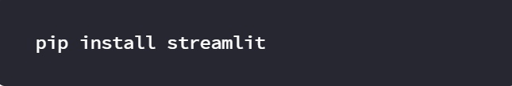
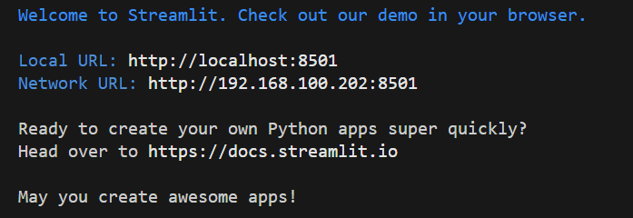
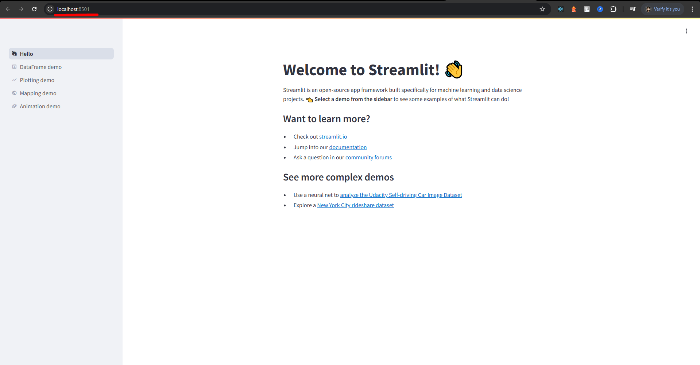

# Streamlit

## How to install and validate Streamlit
- Simple type this command in terminal and run it to instal

or Go to [Official Document](https://docs.streamlit.io/get-started/installation) to learn in detail

- Validate the installation by running our Hello app:

- When you type validation command in terminal and run it, terminal will run local server, as you can see in the below pictures

- Local host shows below screen on your browser

## How to used it

- After installation, go to below link to get insight, how to used it

[Streamlit API cheat sheet](https://docs.streamlit.io/develop/quick-reference/cheat-sheet)

## Make first python file

- Generally we set app.py as a name

## How to run python file

- To run python command we write below command in terminal

**streamlit run app.py**

- You will write the name of your app (if you set other names) instead of app.py

## How to import streamlit in python file

- Write below import on the top of your python file

**import streamlit as st**

Apart from code of app.py, you can also explore display media using Cheat code link

[Streamlit API cheat sheet](https://docs.streamlit.io/develop/quick-reference/cheat-sheet)

## App Gallery

The Streamlit App Gallery is a collection of publicly shared Streamlit apps created by developers and the Streamlit community. It serves as a showcase of different use cases, including data visualizations, AI/ML apps, dashboards, and productivity tools.

### Key Features:

- ✅ **Browse Popular Apps** – See real-world examples of Streamlit in action.
- ✅ **Fork & Customize** – Many apps have open-source code for modification.
- ✅ **Inspiration for Developers** – Learn best practices and UI/UX ideas.
- ✅ **Share Your Own Apps** – Deploy and list your apps in the gallery.

## Components

Streamlit components allow developers to extend Streamlit’s functionality by integrating custom UI elements, JavaScript, HTML, and external libraries into their apps.

### Key Features:
- ✅ **Custom UI Elements** – Add HTML, CSS, JavaScript-based elements like custom buttons, charts, and interactive widgets.
- ✅ **Supports Third-Party Libraries** – Integrate external tools such as Ag-Grid, Kepler.gl, and Plotly for advanced visualizations.
- ✅ **Two-Way Communication** – Components can send and receive data between Streamlit and the frontend (JS/HTML).
- ✅ **Reusable & Modular** – Custom components can be packaged and reused across multiple Streamlit apps.
- ✅ **Built-in & Custom Options** – Use Streamlit’s built-in components or create custom ones with streamlit.components.v1.
- ✅ **Open-Source & Community Support** – The Streamlit Components Directory provides many pre-built components shared by the community.
